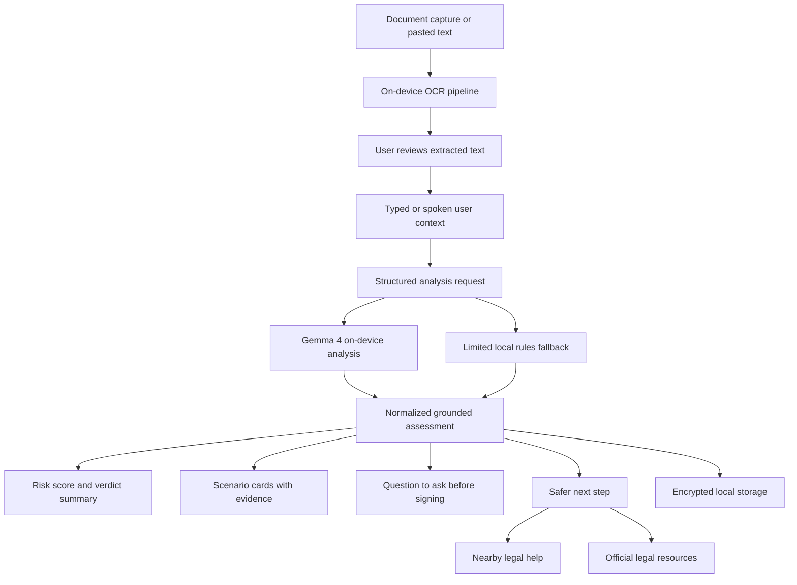

# Architecture

## Overview

Before You Sign is an Android-first, local-first document safety app. It helps users inspect risky paperwork before signing by combining on-device OCR, on-device Gemma 4 reasoning, grounded verdict presentation, and an action layer that points the user toward safer next steps.

The system is intentionally designed around privacy, explicit degradation, and fast comprehension under stress.

## End-to-End Flow

## Main Layers

### 1. Capture and input

The input layer supports:

- live camera capture
- pasted or manually typed document text
- optional spoken or typed context from the user

The capture UI separates the process into two stages:

1. document intake
2. review and context

That split reduces cognitive load and avoids mixing OCR capture, editing, and voice input in one crowded screen.

### 2. OCR pipeline

OCR runs locally through Google ML Kit.

The pipeline includes:

- printed and handwriting-oriented capture modes
- script-aware recognizer selection by locale
- document-focus auto-cropping
- enhanced image passes when the first result is weak
- quality scoring and review notices before analysis
- manual text review and paste fallback for scripts not covered by the current on-device OCR recognizers

This lets the app recover from imperfect capture conditions without pretending the OCR is always correct.

### 3. Analysis request model

The document text, user context, and analysis preference are packaged into a small request object before entering the reasoning layer.

The request explicitly distinguishes between:

- `gemmaOnly`
- `allowLimitedFallback`

That matters because the app should never silently downgrade a full Gemma request into a weaker mode without telling the user.

### 4. Gemma 4 reasoning layer

Gemma 4 is the primary reasoning engine.

The prompt includes:

- OCR document text
- user context
- device locale
- a weak country hint that is explicitly described as non-authoritative

Long OCR text is trimmed into an on-device context-budget view before prompting. The prompt keeps the beginning, ending, and risk-focused excerpts around known warning terms so long contracts are screened without overflowing the Gemma session. The output remains framed as risk awareness, not a complete legal reading of every omitted clause.

The expected output is normalized into a consistent structure with:

- risk score
- risk title
- three scenario cards
- grounded evidence
- question to ask
- safer next step
- disclaimer

### 5. Limited local fallback

If Gemma is unavailable or intentionally bypassed by the user, the app can run a smaller rules-based scan.

That fallback:

- is clearly labeled as limited
- looks for multilingual risk signals
- grounds evidence back to the document or context when possible
- is benchmarked in tests across several languages

It exists to preserve usability under offline or setup-constrained conditions, not to replace Gemma.

### 6. Verdict presentation

The verdict screen is optimized for fast reading:

- gauge-style top-level risk display
- three scenario cards
- evidence source badges
- clause highlighting
- plain-language danger explanation
- shared questions to ask before signing
- one safer next step

The UI tries to answer the user's next real question, not just describe the problem.

### 7. Storage and privacy

Assessments are stored locally with encrypted Hive storage.

Key protections:

- local secure storage for the encryption key
- session unlock enforcement before storage access
- explicit handling for locked, unavailable, and failed storage states

This prevents the app from claiming a protected private vault while actually reading history without device unlock.

### 8. Action layer

After the verdict, the user can move toward action through:

- optional nearby legal-help lookup using location and map services
- official legal-resource links
- spoken verdict playback

The action layer is there because document risk without a next move is often not enough.

## Design Choices

### Gemma-first, not fallback-first

The onboarding and capture flows now steer users toward the full Gemma path by default. Limited scan remains available, but as an explicit choice.

### Grounded output over generic warning

The system prefers evidence-backed warnings and source attribution over vague alarm. This is especially important for the `Safety & Trust` track.

### Local-first under pressure

The most important user moment is often time-sensitive. The architecture is built to keep the primary loop available even when connectivity is poor.

### Honest legal boundaries

Locale is treated as a weak hint, not proof of jurisdiction. The system is careful not to overstate legal certainty.
